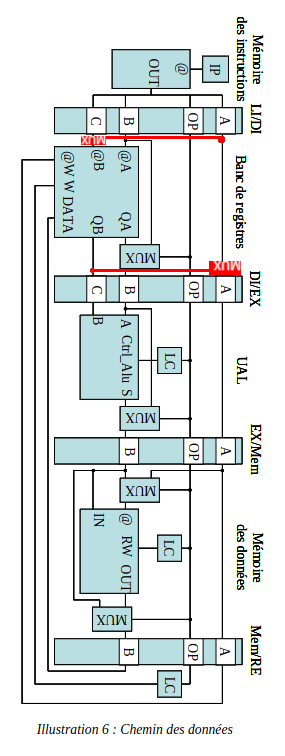

# Foolang

C-style language.

```bash
make clean
make
./compiler.o examples/test.foo
./interpreter.o examples/test.foo.bytecode
xxd examples/test.foo.bytecode # For the curious

# Cross-assemble to CPU ISA in VHDL-compatible format
./compiler.o examples/test_cross.foo
./cross_assembler.o examples/test_cross.foo.bytecode

# Build with -O3, typically for benchmarking the interpreter
make speed

# Test for memleaks during an execution
valgrind --leak-check=full --errors-for-leak-kinds=all --error-exitcode=1 ./compiler.o examples/test.foo
valgrind --leak-check=full --errors-for-leak-kinds=all --error-exitcode=1 ./interpreter.o examples/test.foo.bytecode
```

Compiler Features:

- [x] Multi-var declarations: `const foo, bar = (-1e5 - 3) * 3;`
- [x] if/while
- [x] Comparison operators
- [x] Pointers (added `LOAD`/`STORE` instructions)
- [ ] Function calling
- [x] Perf: reuse allocated immediates where possible, to reduce `COP` instructions
- [x] Output human-readable ASM and bytecode
- [x] Practical error handling (display line number)
- [x] Basic error recovery
- [x] Bytecode interpreter (supports all compiler features)
- [x] Cross-assembler
- [x] Checked for memleaks using `valgrind` at each push

CPU Features:

- [x] All specified assembly instructions
- [x] Data hazards
- [x] PRI outputs to FPGA board LEDs (LSB is left-most)
- [x] FPGA board has reset switch (right-most switch)
- [x] FPGA demo
- [ ] Jumps
- [ ] Function calling instructions and registers

## Design process

### Code modularity

The compiler code was designed into multiple bricks, for separation of concerns and code re-use.
For example, the `asm_table` structure is used in the compiler, interpreter and cross-assembler.

```bash
.
├── cpu/ # Xilinx Vivado project & VHDL code
├── examples/ # Example foo code to test the compiler on
├── .github/workflows/test.yml # Auto compile and check memleaks
├── asm_table.c
├── asm_table.h # Structure handling output assembly instructions
├── cross_assembler.c
├── interpreter.c
├── lang.h
├── lang.l # Lexical analyser
├── lang.y # Syntax analyser
├── main.c # Compiler main
├── Makefile
├── math.h # util
├── README.md # This file, the report
├── symbol_table.c
└── symbol_table.h # Structure handling symbols and address allocations
```

Similarly, the processor VHDL code is broken up into multiple components, allowing for better readability and testing.

### Incremental testing

The code was tested as often as practical, to ensure the changes produce the expected behavior.
For the compiler, it meant building often and parsing/compiling on test files from `./examples/`.
For the processor, it meant many behavioral simulations and periodic synthesis (catches errors that behavioral simulations can miss).

This allowed catching errors early before they pile up.

A Github Actions workflow ensures code compiles and runs without memleaks at every push.

### Refactoring for readability

Variables and functions are named and renamed to allow the code reader to easily understand _what_ the code does.
Comments provide the _why_. Prefixes allow identifying which component it is about (eg. `st_` -> Symbol table).

Enums and constants are used to give meaning to numeric values (eg. `ASM_ADD`, `ST_TABLE_INIT_SIZE`).

## Compiler

Rule actions usually return the memory address of its result.

### Parsing arithmetic and pointers

I used the `DivMul` approach from the calculator example.
It gracefully handles what would be conflicts.
I read about using `%left` but `DivMul` is easier to read.
Parsing the dereference operator (`*`) was as easy as adding a rule to `DivMul`.

### Storing output instructions

Branching requires us to update a parameter from a previous instruction.
I wrote a dynamically-sized `asm_table` to store instructions so they can be edited prior to output.
It is shared across the compiler, interpreter and cross-assembler.

### Symbol table

TODO

TODO COP opti

### Added instructions

`NOP 0 0 0`: opcode `0x00` wasn't used, but can be useful. 

`LOAD ri [rj]` (opcode `0x0D`): Used with pointers. Loads into `ri` the value at the address contained in `rj`. Using the address allows us to iterate over an array (for example) instead of only hardcoded values.

`STORE [ri] rj` (opcode `0x0E`): Used with pointers. Stores the value in `rj` at the adress contained in `ri`. Same story.

Implementing functions would have added `CALL` and `RET`.

## Interpreter

An interpreter handling jumps needs to arbitrarily jump to another section of the code.
Therefore, a LEX/YACC implementation is not practical.

Instead, I stored the assembly instructions as binary/bytecode.
Each instruction is just 32 bytes (opcode + 3 operands, all `int`s)
It's easy to write and read, while being fast.
The `asm_table` can be exported to/imported from bytecode.

The interpreter checks for illegal memory accesses.

It runs until reaching the end of the instructions.


## Cross-Assembler (`./cross_assembler.c`)

The compiler outputs a memory-oriented assembly, while the CPU uses a register-oriented ISA.

It reads the bytecode into an `asm_table` and prints cross-assembled CPU assembly to `stdout`.

### Simple version

I wrote a first straightforward implementation that `LOAD`/`STORE`s values for each instruction.
It leads to useless `LOAD`/`STORE` and multi-cycle data-hazards. I ordered instructions to minimize
data hazards and reduce average cycle count per instruction.

This implementation defeats the purpose of having a register-oriented CPU.

My CPU `LOAD`/`STORE` reads the address from a register, so I must `AFC` the address.
A simpler optimization could be to reuse the `AFC`ed addresses between instructions.

Doesn't support `JMP`/`JMPF` because the CPU doesn't.

### Thougts about further optimization

I thought about using a register->memory mapping with an LRU eviction policy
but it isn't sufficient.

Goals:

- Reduce memory accesses by utilizing all registers
- Reduce instruction count
- Prevent data hazards
- Remain compliant with expected output behavior

Care must be taken with jump instructions because references must remain
valid. Care must be taken with values handled with pointers: `LOAD` can read
from a hard-to-predict address and `STORE` can write anywhere. This `LOAD`/`STORE`
behavior requires us to commit all changes to memory.

I designed but didn't implement the following idea. A first forward pass:

- checks whether the code contains `LOAD` or `STORE` instructions.
  If none are present, we don't need to commit all changes to memory.
- stores up to which instruction a value is needed (either last used before overwritten or if before a jump)

Second forward pass outputs instructions.
It stores values in registers, and adds `STORE` memory commits to a queue.
The queue is flushed when the following instruction is a `LOAD`, `STORE` or jump,
when a register is about to be overwritten, or when we expect a data hazard.

## 5-stage RISC processor

The main `processor.vhdl` file handles data paths and updates values between stages.
It consists of combinatorial signals and one process whos job is to copy values between stages.

### Data bank synchronization

The memory data bank is synchronous. Using the same clock and waiting for `rising_edge`
led to a race condition between the data bank process and the the processor process that updates the stage inputs.

My data bank process syncs on `falling_edge` to mitigate this issue. This was approved by a teacher.

### Data hazards

The destination register is always A.
We save the 3 previous destination registers and whether they were used (NOP).
If the register is reused by B or C, the processor freezes the Instruction Pointer until the data hazard has passed.

It also syncs on `falling_edge`.

### Added/modified instructions

The specified `LOAD`/`STORE` instructions read the address from the code rather than from a register.
This is constraining, and doesn't allow iterating (for example over an array or a pointer).
Instead, we modified the ISA to read the address from a register (like in the memory-oriented ISA).
We obtain the following data path:



Furthermore, in order to display outputs on the FPGA dev board, we added the `PRI` (opcode `0x9`) print instruction.
It takes one register as a parameter and updates the value shown on the LEDs.
However, to simplify the data hazard handling, instead of using the first parameter, we use the second.
Example: `PRI 1 2 3` displays the value in `r2`. `1` and `3` are discarded.

### FPGA dev board demo

The Basys 3 has a clock frequency of 50 MHz.
This is way to fast for the human eye to appreciate.
I divided the clock in `main.vhdl`.

The reset switch (right-most switch) should be switched on/off for a proper reset.
The LEDs should then be updated upon `PRI`.
The Least Significant Bit is the left-most LED.

TODO add image. Show LSB, MSB. Show reset switch.

